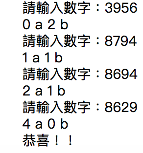

# pythonpractice--1a2b


## 遊戲解說

不重複版本
猜數字：隨機猜四個數字
之後便會告知幾Ａ幾Ｂ
Ａ代表著 位置與數字都是對的 無需更改
Ｂ代表著 此數字存在於答案中 但並非相同位置

## 邏輯簡介

### 答案生成

首先會在0~9 的整數中 隨機挑出不重複的四個數字 放在陣列裡

***

```python

import random 
list = [n for n in range(10)]
answer = random.sample(list,4)
print(answer)

```

***

###判斷 

判斷方式 則是先讓 輸入數字與答案的位置一一比對 如果相符則 a ＋ 1
如果不符合 則在確認 輸入的數字是否有和答案中陣列的元素相符 有則 b + 1 

***

```python
 def abab(string) :
    a=0
    b=0    
    for n in range(4):
        if int(string[n]) == answer[n]:
            a+=1
        elif int(string[n]) in answer :
            b+=1
    print(a,"a",b,"b")
    return a 
```

***

##執行介面



     